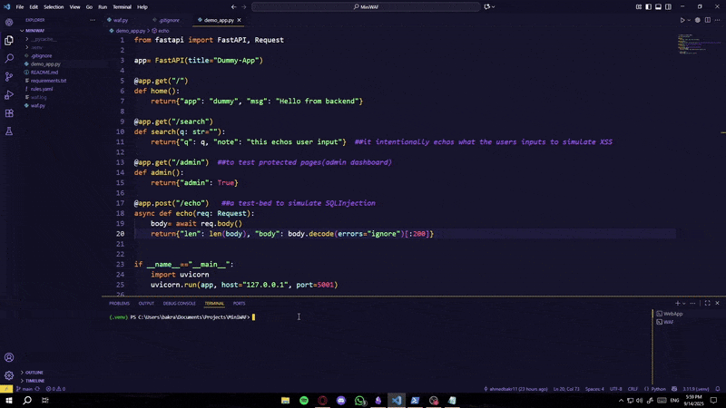

# 🛡️ Mini WAF — Portfolio Project

A lightweight **Web Application Firewall (WAF)** built with **FastAPI**.  
It sits as a **reverse proxy** in front of a vulnerable demo app, inspecting all requests for malicious patterns such as **XSS, SQL Injection, Path Traversal, and Command Injection**.

---

## 🎥 Project Showcase
  
*Snapshots of the project demo*

---

## 🚀 Features
- **Reverse Proxy**: All traffic passes through the WAF before reaching the backend.  
- **Configurable Rules**: Detection patterns written in `rules.yaml` (easy to extend).  
- **Regex-based Detection**:
  - Cross-Site Scripting (XSS): `<script>`, `onerror=`, `javascript:`  
  - SQL Injection: `UNION SELECT`, `OR 1=1`, `SLEEP(...)`  
  - Path Traversal: `../`, `%2e%2e/`  
  - Command Injection: `; ls`, `&& cat /etc/passwd`  
- **IP Access Control**: Allowlist & blocklist support.  
- **Rate Limiting**: Prevents brute-force attempts per IP.  
- **Protected Paths**: Example — `/admin` only accessible from allowlisted IPs.  
- **Logging**: Blocked and suspicious requests are written to `waf.log`.

---

## ⚡ Setup

### 1. Install dependencies
```bash
python -m venv .venv
.venv\Scripts\activate   # on Windows
pip install -r requirements.txt
```

### 2. Run the vulnerable backend
```bash
python demo_app.py
```
*Webapp runs at: http://127.0.0.1:5001*

### 3. Run the WAF
```bash
uvicorn waf:app --host 127.0.0.1 --port 8080
```
*WAF listens at: http://127.0.0.1:8080*
